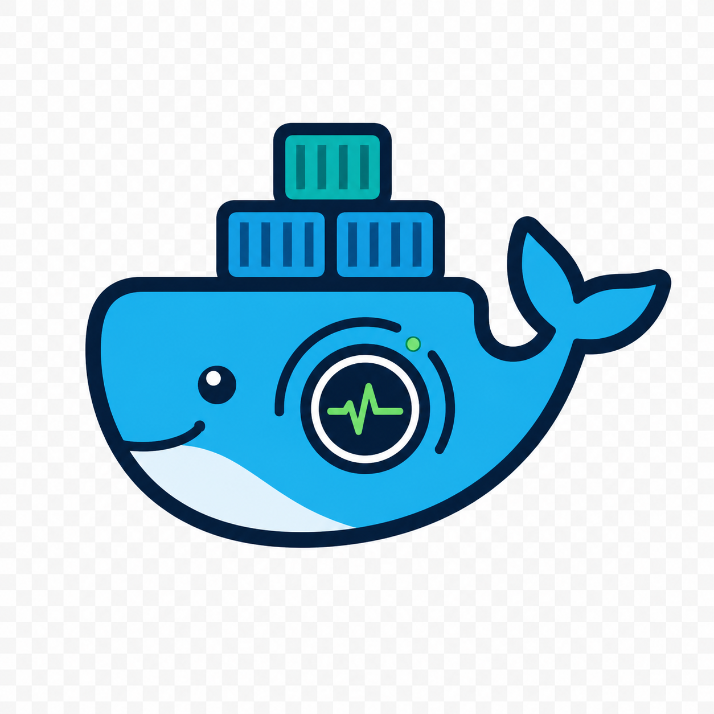

# Docker Watcher 🐳

<p align="center">
  
</p>

<p align="center">
  <a href="https://github.com/Greg222777/docker-watcher/stargazers"></a>
  <a href="https://github.com/Greg222777/docker-watcher/tags"></a>
  <a href="https://github.com/Greg222777/docker-watcher/actions/workflows/ci.yml"></a>
  <a href="https://hub.docker.com/r/gregorynowik/docker-watcher"></a>
  <a href="https://hub.docker.com/r/gregorynowik/docker-watcher"></a>
</p>

Docker Watcher monitors Docker container events, stores them locally in SQLite,
captures recent container logs, and can send Telegram notifications when watched
events happen.

## Features ✨

- Watches Docker container events.
- Stores event history locally in SQLite.
- Captures recent container logs for recorded events.
- Analyzes captured logs with OpenAI when an API key is configured.
- Sends optional Telegram notifications.
- Provides a Flask web UI.
- Runs with Docker Compose.

## Requirements 📦

- Docker
- Docker Compose
- A Telegram bot token and chat ID if you want notifications
- An OpenAI API key if you want AI log analysis

## Installation With Docker 🚀

Create a `docker-compose.yml` file:

```yaml
services:
  dockerwatcher:
    image: gregorynowik/docker-watcher:latest
    container_name: dockerwatcher
    restart: unless-stopped
    environment:
      - TELEGRAM_BOT_TOKEN=your_bot_token_here
      - TELEGRAM_CHAT_ID=your_chat_id_here
      - OPENAI_API_KEY=your_openai_api_key_here
      - WEB_PORT=8000
      - LOG_LEVEL=INFO
    ports:
      - "8000:8000"
    volumes:
      - /var/run/docker.sock:/var/run/docker.sock
      - dockerwatcher_data:/data

volumes:
  dockerwatcher_data:
```

The Docker socket mount is required so Docker Watcher can listen to container
events.

Then start Docker Watcher:

```sh
docker compose up -d
```

Open the web UI:

```text
http://localhost:8000
```

## Configuration ⚙️

| Variable | Default | Description |
| --- | --- | --- |
| `TELEGRAM_BOT_TOKEN` | empty | Telegram bot token. Leave empty to disable notifications. |
| `TELEGRAM_CHAT_ID` | empty | Telegram chat ID that should receive notifications. |
| `OPENAI_API_KEY` | empty | OpenAI API key used for AI log analysis. Leave empty to disable AI analysis. |
| `WEB_PORT` | `8000` | Port used by the Flask web UI inside the container. |
| `LOG_LEVEL` | `INFO` | Application log level, for example `DEBUG`, `INFO`, `WARNING`, or `ERROR`. |

Telegram is optional. If `TELEGRAM_BOT_TOKEN` or `TELEGRAM_CHAT_ID` is missing,
Docker Watcher still runs, but notifications are skipped.

OpenAI is optional. If `OPENAI_API_KEY` is missing, Docker Watcher still runs,
but AI log analysis is unavailable.

## Storage 💾

Docker Watcher stores the SQLite database and captured container logs in `/data`
inside the container.

The Docker Compose example uses the `dockerwatcher_data` named volume. Keep it
if you want event history and captured logs to persist across container restarts
and updates.

## Monitoring Options 👀

Docker Watcher listens to Docker container events and only records or sends
notifications for the actions selected in the web UI options.

The selection is stored in SQLite, so it is preserved when Docker Watcher
restarts.

By default, Docker Watcher monitors abnormal or operationally important
container actions:

```text
destroy
die
exec_die
health_status
kill
oom
pause
restart
stop
```

Use the official Docker event documentation to decide what matters for your
setup:

```text
https://docs.docker.com/reference/cli/docker/system/events/
```

Recommended choices:

- Keep `die`, `oom`, `kill`, `stop`, and `restart` enabled if you want alerts when containers stop, crash, or are killed.
- Keep `health_status` enabled if your containers define Docker health checks.
- Enable `start`, `create`, or `destroy` if you want lifecycle visibility, not only failures.
- Disable noisy actions such as `attach`, `resize`, `top`, or `exec_start` unless you specifically need audit-style visibility.
